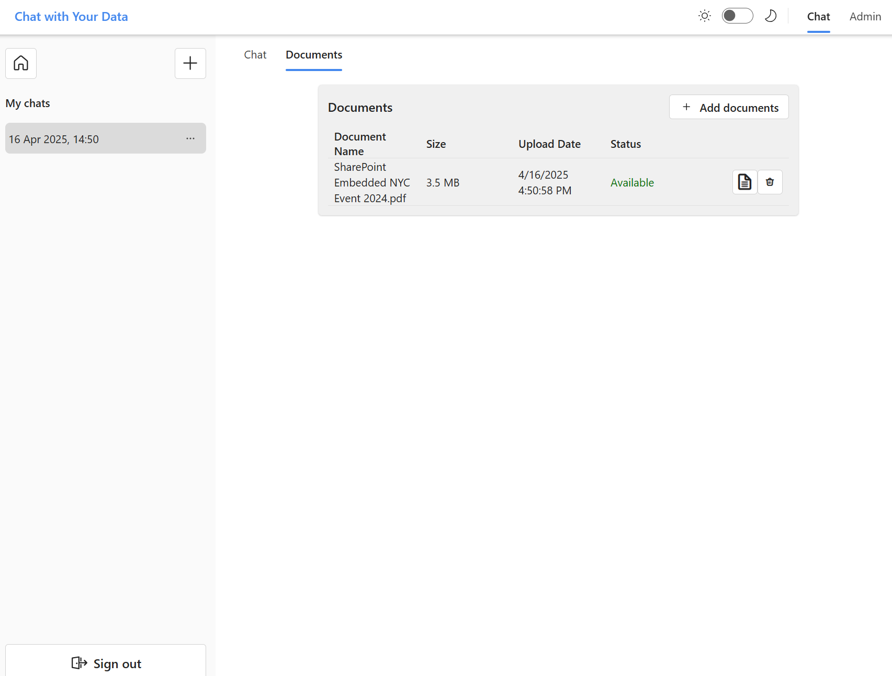
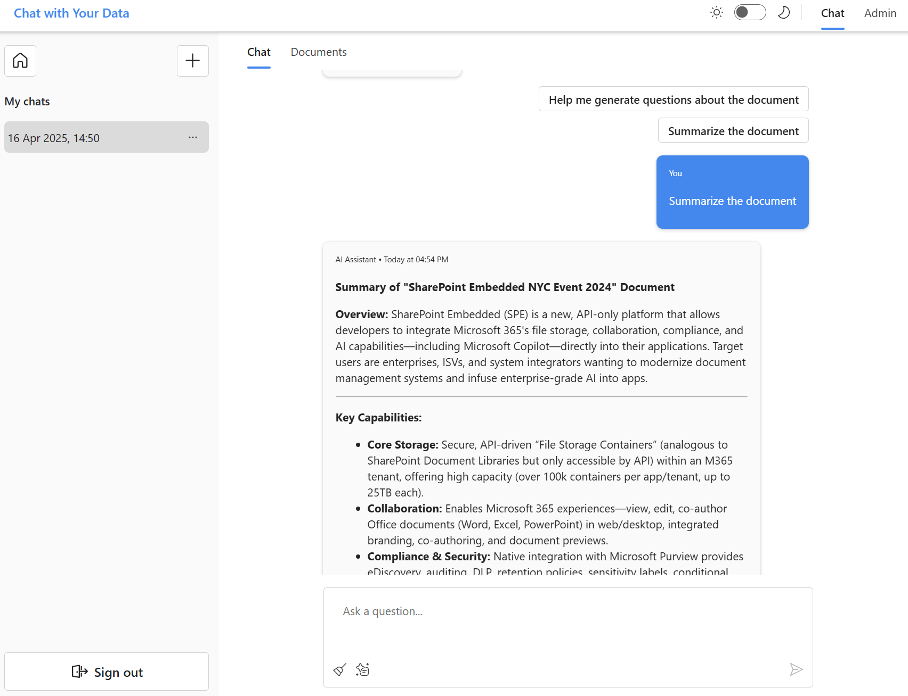
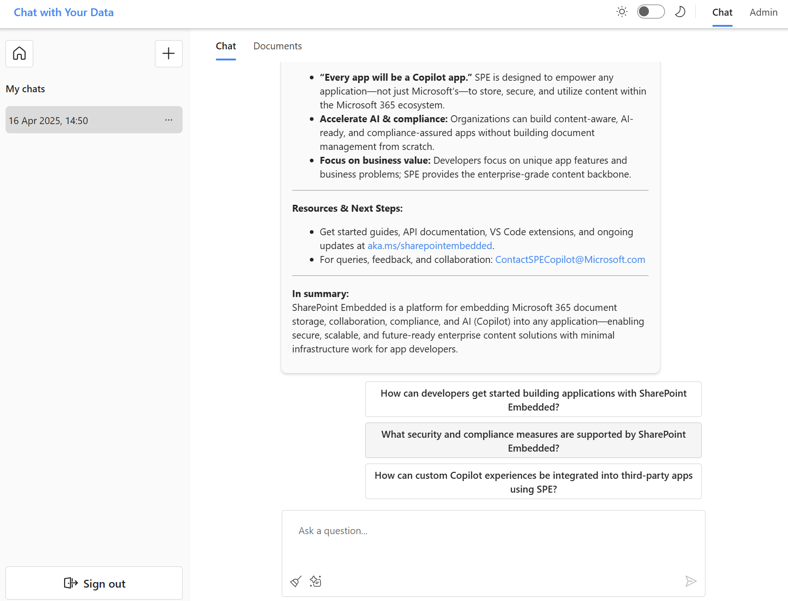
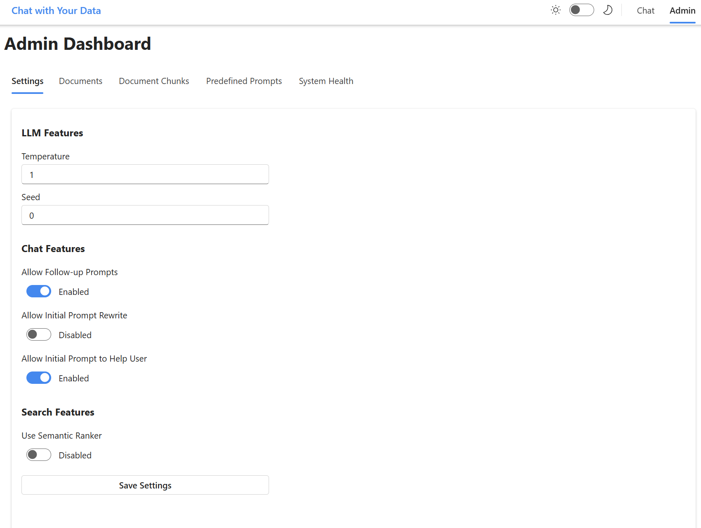
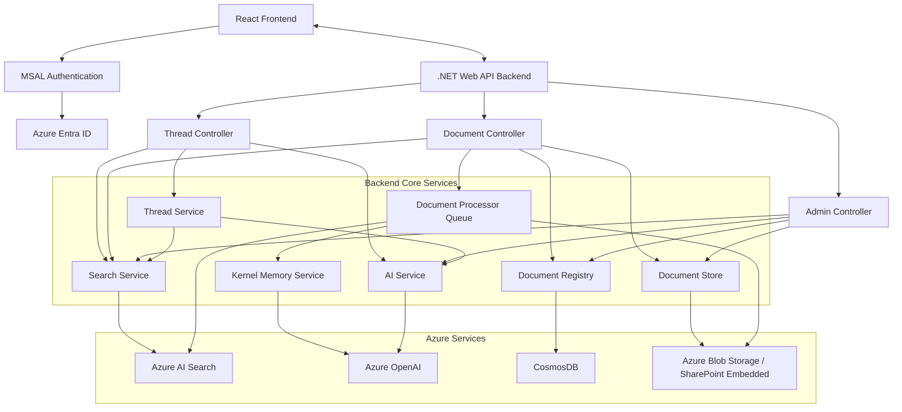

# Chat With Your Data - Multi-User Edition

Yes, yet another sample repo on how to do "chat with your data" (RAG) in a multi user scenario where chat-threads are long lived ;)

## 🚀 Features

- **Interactive Chat Interface**: Modern, responsive UI built with React and FluentUI
- **Document Management**: Upload, manage, and chat with your documents
- **Multi-User Support**: Enterprise-ready with authentication and user-specific document access
- **AI-Powered Responses**: Leverages Large Language Models to provide intelligent responses based on document content
- **Admin Dashboard**: Configure settings, view system health, and manage documents

## 📸 Application Screenshots

<a href="docs/uploaddocument.png" target="_blank">
  
</a>

<a href="docs/firstchatsummary.png" target="_blank">
  
</a>

<a href="docs/followup.png" target="_blank">
  
</a>

<a href="docs/admin.png" target="_blank">
  
</a>

## 🔧 Technology Stack

### Frontend
- **React** with TypeScript for a modern, type-safe UI
- **FluentUI Components** for Microsoft's design language
- **MSAL Authentication** for secure user access
- **Responsive Design** for desktop and mobile

### Backend
- **.NET Web API** for robust backend services
- **[Semantic Kernel](https://github.com/microsoft/semantic-kernel)** for AI orchestration and chat completion
- **[Kernel Memory](https://github.com/microsoft/kernel-memory)** for document processing and embedding
- **Health Monitoring** for system reliability

### Azure Services
- **Azure AI Search** for intelligent retrieval of document contents
- **CosmosDB** for storing conversations and document metadata
- **Azure Blob Storage** or **SharePoint Embedded** for document storage
- **Azure OpenAI** for advanced language understanding and generation

## 🧠 Document Processing

The application supports two ways to process documents:

1. **Local Processing**: Kernel Memory locally chunks and embeds documents
2. **AI Search Indexer**: Uses AI Search skillsets for document processing

## 🏗️ System Architecture

The following diagram illustrates how all components of the application are connected:



### Key API Endpoints

#### Thread Controller
- `GET /threads` - Get all threads for a user
- `POST /threads` - Create a new thread
- `DELETE /threads/{threadId}` - Delete a thread
- `PATCH /threads/{threadId}` - Update thread title
- `GET /threads/{threadId}/messages` - Get all messages in a thread
- `POST /threads/{threadId}/messages` - Send a message and get AI response
- `DELETE /threads/{threadId}/messages` - Delete all messages in a thread

#### Document Controller
- `GET /threads/{threadId}/documents` - Get all documents for a thread
- `POST /threads/{threadId}/documents` - Upload documents to a thread
- `GET /threads/{threadId}/documents/{documentId}/chunks` - Get document chunks
- `DELETE /threads/{threadId}/documents/{documentId}` - Delete a document
- `DELETE /threads/{threadId}/documents` - Delete all documents for a thread

#### Admin Controller
- `GET /admin/settings` - Get application settings
- `PATCH /admin/settings` - Update application settings
- `GET /admin/documents` - Get all documents in the system
- `GET /admin/documents/{documentId}/chunks` - Get chunks for a document
- `GET /admin/threads` - Get all threads in the system
- `GET /admin/check` - Health check of all system components

## 🚀 Deployment Instructions

### 1. Register Applications in Entra ID

The solution requires registering both frontend and backend applications in Entra ID. We provide helper scripts to automate this process:

```powershell
# Create backend app registration
./deploy/create-backendAppReg.ps1 -DisplayName "YourAppName-Backend"

# Create frontend app registration
./deploy/create-frontendAppReg.ps1 -DisplayName "YourAppName-Frontend" -BackendAppId "your-backend-app-id"
```

These scripts will:
- Create the necessary app registrations
- Configure proper API permissions
- Set up the required scopes for communication

Alternatively, you can manually configure:

#### Backend App Registration
1. Create an app registration in Entra ID (Azure AD)
2. Expose an API with a custom scope named `chat`
3. Note the client ID and scope value

#### Frontend App Registration
1. Create a separate app registration
2. Add the following permissions:
   - `offline_access`
   - `openid`
   - `User.Read`
   - The custom API scope from the backend app

### 2. Deploy Infrastructure

1. Create a resource group in Azure
2. Run the following command from the `infra` folder:

```powershell
az deployment group create --template-file main.bicep -g "YOUR-RESOURCE-GROUP-NAME"
```

You'll need to provide:
- `azureAdInstance`: https://login.microsoftonline.com/
- `azureAdClientId`: Client ID of the backend app registration
- `azureAdTenantId`: Your Entra ID tenant ID

### 3. Configure Authentication

After deploying infrastructure:

1. In the frontend app registration, add a redirect URI for a single-page application
2. Use the base URL of the deployed frontend app (e.g., https://frontend-{someid}.azurewebsites.net/)
3. Enable access token and ID token flows

### 4. Deploy Application Code

Run the deployment script from the `deploy` directory:

```powershell
./deploy.ps1
```

You'll need to provide:
- Resource group name
- Frontend and backend app service names (from bicep output)
- Backend URL (from bicep output)
- Backend API scope (from step 1)
- Frontend app ID
- Authority URL (https://login.microsoftonline.com/{tenant-id})

### 5. SharePoint Embedded (Optional)

If you want to use SharePoint Embedded for document storage instead of Azure Blob:

```powershell
./deploy/setup-SharePointEmbedded.ps1
```

This script will create and configure the necessary SharePoint Embedded resources.

## 🌟 Getting Started

After deployment completes, you can access the application through the frontend URL. The main features include:

1. **Authentication**: Log in with your corporate credentials
2. **Document Management**: Upload documents through the Documents tab
3. **Conversations**: Chat with the AI about your documents
4. **Admin Features**: Configure system settings, manage documents, and monitor health

## 🤝 Contributing

This project welcomes contributions and suggestions. Most contributions require you to agree to a Contributor License Agreement (CLA) declaring that you have the right to, and actually do, grant us the rights to use your contribution.

When you submit a pull request, a CLA bot will automatically determine whether you need to provide a CLA and decorate the PR appropriately. Simply follow the instructions provided by the bot.

This project follows the [Microsoft Open Source Code of Conduct](https://opensource.microsoft.com/codeofconduct/).

## Trademarks

This project may contain trademarks or logos for projects, products, or services. Authorized use of Microsoft trademarks or logos is subject to and must follow [Microsoft's Trademark & Brand Guidelines](https://www.microsoft.com/en-us/legal/intellectualproperty/trademarks/usage/general).
Use of Microsoft trademarks or logos in modified versions of this project must not cause confusion or imply Microsoft sponsorship.
Any use of third-party trademarks or logos are subject to those third-party's policies.
